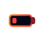
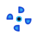
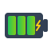

# 🌈 NeoGlow Icons - Animated & Colorful Gradient Icons for Home Assistant

<div align="center">

[](https://github.com/hacs/integration)


<br/>

[](https://ko-fi.com/A0A81R5DP5)

<br/><br/>

### 💎 Animated & Colorful Gradient Icons Showcase
  
  
  
  
  
  
  
  
  
  

</div>


Welcome to **NeoGlow Icons**, the ultimate way to revolutionize your Home Assistant dashboards!

> [!IMPORTANT]
> **NeoGlow Icons** is currently the **ONLY custom icon pack available in HACS that features fully animated and multi-color gradient icons**! While typical icon sets are static and monochrome, NeoGlow icons are alive with smooth CSS keyframe animations, vibrant neon HSL gradients, and dynamic visual states.

---

## 🖥️ Official Companion Web Explorer

To search, preview, and easily copy the icon codes, we provide a state-of-the-art web search utility:
👉 **[https://total.smallhost.pl/hacs-neoglow-explorer/](https://total.smallhost.pl/hacs-neoglow-explorer/)**

### What is the `hacs-neoglow-explorer`?
The **NeoGlow Explorer** is a high-performance, glassmorphic web dashboard that serves as the official catalog for all available icons. 
* **Real-Time Live Previews**: See every single icon's animation speed, gradient style, and glowing neon effects exactly as they appear in Home Assistant.
* **Instant Search Engine**: Find icons instantly using filters and keywords (lighting, climate, media, sensors).
* **Click-to-Copy convenience**: Simply click any icon tile to copy its Home Assistant code (e.g. `b31:gear_bolt_X9rB` or complete YAML) straight to your clipboard for instant setup.

---

## 🚀 Easy HACS Installation

### Step 1: Add Custom Repository to HACS
1. Open your **Home Assistant** instance.
2. Navigate to **HACS** -> **Frontend** on the left sidebar.
3. Click the **Three Dots** menu in the top-right corner and select **Custom repositories** (*Niestandardowe repozytoria*).
4. In the URL field, paste the link to this GitHub repository:
   ```text
   https://github.com/totalcodingpl/ha-neoglow-icons
   ```
5. Choose **Lovelace** (or *Dashboard*) as the Category.
6. Click **Add** (*Dodaj*).

### Step 2: Download the Plugin
1. Find the newly added **NeoGlow Icons** plugin in your HACS list.
2. Click on it, then click **Download** (*Pobierz*) in the bottom right corner.
3. HACS will download the files and should prompt you to reload your browser.
4. **Important**: If HACS does not automatically add the Lovelace resource, go to **Settings** -> **Dashboards** -> **Resources** in Home Assistant, and manually add `/hacsfiles/ha-neoglow-icons/b31-icons.js` as a **JavaScript Module**.

### Step 3: Hard Reload Browser Cache
Execute a hard reload in your web browser (`Ctrl` + `F5` on Windows/Linux, or `Cmd` + `Shift` + `R` on macOS) to ensure the Lovelace resource is loaded.

---

## 💎 Premium Showcase Icons Detailed Specs

Below is the technical specification of the keyframe CSS animations and state definitions for our featured animated icons:

| HA Icon ID | Description | CSS Animation Style |
| :--- | :--- | :--- |
| `b31:motion_detect_k9x2` | Active motion detection sensor | Integrated pulse & rotation |
| `b31:bell_ringing_p2m4` | Ringing notification bell | Integrated swing animation |
| `b31:warning_alert_q5v8` | Critical warning alert symbol | Pulse animation |
| `b31:lgg_wifi_signal_wf2` | Wi-Fi signal strength indicator | Sequential wave animation |
| `b31:lgg_battery_low_bt2` | Low battery state | Blink/Pulse animation |
| `b31:lgg_fan_ceiling_fn1` | Ceiling fan spinning | Infinite rotation |
| `b31:alarm_alert_r4w0` | Security alarm indicator | Flash/Blink animation |
| `b31:gear_bolt_X9rB` | Rotating gear combined with a pulsing lightning bolt | Integrated (spin + pulse glow) |
| `b31:sensor_battery_R6vC` | Battery sensor with levels | Level indicator animation |
| `b31:lgg_presence_home_pr1` | Presence home sensor with dash circle | Outer circle rotation & pulse |

---

## 🎨 Lovelace YAML Examples

### Example 1: Standard Button Card
```yaml
type: button
name: Ambient Fan
icon: b31:fan_2vPq
tap_action:
  action: toggle
entity: fan.living_room
```

### Example 2: Mushroom Template Card (RGB Glow)
```yaml
type: custom:mushroom-template-card
primary: Smart Ambient
secondary: "{{ states('light.ambient_rgb') }}"
icon: b31:acx_light_rgb_z1p3
entity: light.ambient_rgb
```

---

## 👥 Support & Development

Developed and optimized by **Gringo Swarm**. For requests, new icon suggestions, or issues, please open a GitHub Issue in this repository.

### 💖 Support My Work on Ko-fi

If you enjoy using **NeoGlow Icons** and want to see this collection grow, please consider supporting my work on Ko-fi! Your support directly allows me to dedicate more time to designing, optimizing, and adding more unique, animated, and colorful gradient icons to the Home Assistant database. Every single cup of coffee helps expand the collection!

<div align="center">
  <br/>
  <a href="https://ko-fi.com/A0A81R5DP5"></a>
</div>
